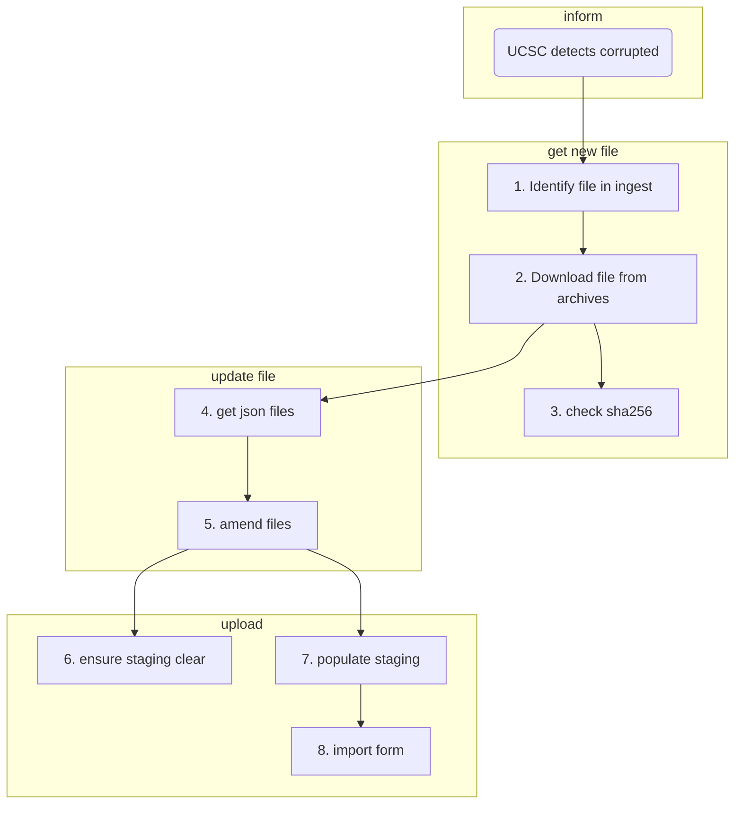

# Update corrupted files in TDR

Here is a guide on how to update files published in Terra Data Repository that have been identified as corrupted. 

## Context
Use case issue: [#1396](https://github.com/ebi-ait/hca-ebi-wrangler-central/issues/1396)

UCSC team performs checks on the integrity of the data. During such check, they might identify mismatches in the checksum of file in TDR and checksum in metadata.

In such cases, uncorrupted data should be re-submitted by wranglers. One option would be to re-export data from ingest. However, [upload api](https://github.com/ebi-ait/upload-service) doesn't allow us to re-upload files that have previously been deleted.
A workaround is to override ingest and update file directly in the staging area. In order for TDR to allow overwriting the previous file, we should update the file version. Files that we don't want to update don't have to be in staging area.

## process
1. [identify the corrupted files in database](#1-identify-the-corrupted-files-in-database)
2. [identify and download correct file from archives](#2-identify-and-download-correct-file-from-archives)
3. [calculate sha256 checksum hash](#3-calculate-sha256-checksum-hash)
4. [get json metadata/ descriptor for files](#4-get-json-metadata-descriptor-for-files)
5. [amend json files according to dcp2 SOP](#5-amend-json-files-according-to-dcp2-sop)
6. [ensure staging area is cleaned](#6-ensure-staging-area-is-cleaned)
7. [populate staging area](#7-populate-staging-area):
	1. `/data` with correct files
	2. `/metadata/*file` with amended json
	3. `/descriptors/*file` with amended json
8. [import form](#8-import-form)



### 1. identify the corrupted files in database
In order to identify the file in ingest database, you would need to query ingest with the following `command` or `python script`.

```bash
curl --request POST \
  --url 'https://api.ingest.archive.data.humancellatlas.org/files/query?operator=AND' \
  --header 'Authorization: Bearer <token>' \
  --header 'Content-Type: application/json' \
  --data '[
	{
		"field": "content.file_core.file_name",
		"operator": "IS",
		"value": "<file_name>"
	}
]'
```
or
```python
from hca_ingest.api.ingestapi import IngestApi
api = IngestApi(url="https://api.ingest.archive.data.humancellatlas.org/")
api.set_token(f"Bearer {<token>}")
query = [{'field': 'content.file_core.file_name', 
		  'operator': 'IS', 
		  'value': '<file_name>'}]
response = api.post('https://api.ingest.archive.data.humancellatlas.org/files/query?operator=AND', json=query)
```

#### Note:
First, verify that project is not Managed Access. If it's managed access, we should reach out to contributor to provide file again and make sure that file is not downloaded locally at any time. Descriptors and file metadata should be fine to have locally.

From the output, identify the file `uuid`, and information that would help to identify file in the archive. For example, if it's `sequence_file` we could look for `insdc_run_accession`, `insdc_experiment_accession`, `read_index` and `lane_index`.

### 2. identify and download correct file from archives
Using information from step 1, we will try to identify the file in the archives (for example, [ENA](https://www.ebi.ac.uk/ena/browser/) if file in INSDC). If we know that the corrupted file was not retrieved from an archive but from a contributor see [note](#note) above.

If corrupted file is fastq derived from BAM file, take advantage of the complementary read_index to identify the library that was specified in tha bamtofastq argument.

Download locally, unless it is managed access.

### 3. calculate sha256 checksum hash
Here we want to verify that the substitution we are attemting makes sense. 

1. Use command `sha256` or equivalent to get the hash of the downloaded file.
1. Compare the `sha256` value with:
    1. Corrupted file's `sha256` (provided by the indexing team)
	1. `sha256` value in metadata (if not provided bu indexing team, seek inside descriptor file in [next step](#4-get-json-metadata-descriptor-for-files)).
1. If downloaded's file `sha256` value:
	1. matches to value in corrupted file, and file can be accessed, it's possible that error is on metadata value. TODO: add SOP for updating metadata only.
	1. matches to value in metadata file, file has been corrupted at one point after deposition in staging area, the sha256 value should match the value in the metadata. Re-submitting the file should fix the issue.
	1. doesn't match any value but we are sure that TDR file is corrupted and the downloaded file is the correct file, we can proceed to next step as well.

### 4. get json metadata/ descriptor for files
In order to do an update, we need the metadata and descriptor files to accompany the data file (links are not needed since we are not changing the `file_uuid`). If we can't re-genarate metadata and descriptor files from ingest by re-exporting project, we will have to override ingest and access the previously exported files.

This could be done either from staging (if dir is not cleared up) or from TDR (someone with access to tables could provide those to us).

#### Get metadata & descriptors from staging area

Check if staging area for project is still filled, with the following command:
```bash
gsutil ls gs://broad-dsp-monster-hca-prod-ebi-storage/prod/<project-uuid>/metadata/<entity_type>
```
and identify the file with the file <uuid> in the file_name prefix.

Download locally the `/metadata` file and the `/descriptors` file. Both have the same file_name so make sure to download in different directories. Staging has the following structure (if entity is `sequence_file`):
```
<project-uuid>/
├── data/
│   ├── SRR111111_1.fastq.gz
│   └── ...
├── metadata/
│   └── sequence_file/
│       ├── <file_uuid>_<timestamp>.json
│       └── ...
└── descriptors/
    └── sequence_file/
        ├── <file_uuid>_<timestamp>.json
        └── ...
```

Ideally, use the same hierahical folder structure by downloading the whole dir with these commands.
```shell
gsutil -m cp -r gs://broad-dsp-monster-hca-prod-ebi-storage/prod/<project-uuid>/metadata <path/to/download/metadata>
gsutil -m cp -r gs://broad-dsp-monster-hca-prod-ebi-storage/prod/<project-uuid>/descriptors <path/to/download/descriptors>
```

#### Get metadata & descriptors from TDR
If staging area is cleaned up and no such file exist there, ask the import team or indexing team in initial slack thread to pull these json files from TDR and share.

### 5. amend json files according to dcp2 SOP

We want to edit the files so that TDR will understand that these are separate **versions**. We might also need to update the **checksum** as well. 

Updating to higher version means adding a most recent update-date. It doesn't have to be the actual date of update, just a most recent one.

The changes for TDR to percive this file as an update are described in [dcp2 SOP](https://github.com/HumanCellAtlas/dcp2/blob/main/docs/dcp2_system_design.rst#442update-a-data-file). Here is are the precise changes that needs to be done:
- `metadata` file:
	- `provenance.update_date` to any more recent date in the format ([ISO_8601](https://en.wikipedia.org/wiki/ISO_8601) is used, for example: `2025-08-07T16:15:39.822Z`)
	- update the **metadata** file `file_name` suffix (not `file_name` field) with the same most recent date.
		<br>For example:<br>
		`aaaaaaaa-5258-aaaa-84f3-aaaaaaaaaaaa_2025-08-22T13:43:40.996000Z.json` should be renamed to <br>`aaaaaaaa-5258-aaaa-84f3-aaaaaaaaaaaa_2025-09-23T14:45:40.996000Z.json`
		<br>Note: trailing digits after decimal point compared to ISO_8601.
- `descriptor` file:
	- `file_version` to any more recent date in the format ([ISO_8601](https://en.wikipedia.org/wiki/ISO_8601) is used, for example: `2025-08-07T16:15:39.822Z`)
    - `file_name` might have the bundle uuid as a prefix to the actual file_name like `30fb759a-546a-4cfa-a55a-195bc008621a/SRR1111111_1.fastq.gz`. this uuid up to `/` character needs to be removed to leave clean file_name
	- make sure that `size`, `sha1`, `sha256` and `crc32c` are updated as well (check script bellow)
	- update the **descriptor** file `file_name` suffix (not `file_name` field) with the same most recent date.
		<br>Similarly:<br>
		`aaaaaaaa-5258-aaaa-84f3-aaaaaaaaaaaa_2025-08-22T13:43:40.996000Z.json` should be renamed to <br>`aaaaaaaa-5258-aaaa-84f3-aaaaaaaaaaaa_2025-09-23T14:45:40.996000Z.json`
		<br>Note: trailing digits after decimal point compared to ISO_8601.

<details><summary>script to edit descriptor contents</summary>

If the documents is structured in a hierahical way as it is in staging area you could use the following script:
(Update `today` variable with the desired update-date, or update the entity_type if file is not sequence file)

```python
"""
That's a script to replace (valid) descriptor contents with correct hash values and 
"""
import os
import re
import json
import hashlib
import google_crc32c

proj_uuids = [proj for proj in os.listdir() if os.path.isdir(proj)]
# get filenames
filenames = []
for proj in proj_uuids:
	filenames.extend([proj + '/data/' + f for f in os.listdir(proj + '/data/')])

# get hashes
hashes = {}
for filename in filenames:
	hashes[filename] = {}
	with open(filename, "rb") as file:
		while (byte:= file.read()):
			hashes[filename]['sha1'] = hashlib.sha1(byte).hexdigest()
			hashes[filename]['sha256'] = hashlib.sha256(byte).hexdigest()
			hashes[filename]['crc32c'] = f'{google_crc32c.value(byte):02x}'.zfill(8)
			hashes[filename]['size'] = os.path.getsize(filename)

# get descriptors filenames
descriptors = []
for proj in proj_uuids:
	descriptors.extend([proj + '/descriptors/sequence_file/' + f for f in os.listdir(proj + '/descriptors/sequence_file/')])

today = '2025-07-16T13:33'
for descriptor in descriptors:
	proj = descriptor.split('/')[0]
	with open(descriptor, 'r') as file:
		d = json.load(file)
		d['file_version'] = today + d['file_version'][16:]
		seq_file = proj + '/data/' + d['file_name'].split("/")[1]
		d.update(hashes[seq_file])
	os.remove(descriptor)
	descriptor = re.sub(r'\d{4}-\d{2}-\d{2}T\d{2}:\d{2}', today, descriptor)
	with open(descriptor, 'w') as file:
		json.dump(d, file)
```
</details>

### 6. ensure staging area is cleaned

Make sure that staging area has been cleared from other files that might cause validation to fail. The following command will clear up the whole project from staging area.

CAUTION! Make sure that all contents of directory are intended to be removed (or not updated). If ingest is not working we would not be able to re-populate with files deleted here!
```shell
gsutil -m rm -r gs://broad-dsp-monster-hca-prod-ebi-storage/prod/<project-uuid>
```

### 7. populate staging area
Next step is to upload files into the staging area.

1. #### `/data`
    Upload correct files into the staging area with the command:
    ```shell
    gsutil cp <path/to/file_name> gs://broad-dsp-monster-hca-prod-ebi-storage/prod/<project-uuid>/data/<file_name>
    ```
2. #### `/metadata/*file`
    Upload amended metadata json files. Careful not to upload the descriptor file that share the same name.
    ```shell
    gsutil cp <path/to/metadata_file_name> gs://broad-dsp-monster-hca-prod-ebi-storage/prod/<project-uuid>/metadata/<entity_name>/<metadata_file_name>
    ```
3. #### `/descriptors/*file`
    The same with amended descriptor json. Again be careful not to upload metadata file that share the same name.
    ```shell
    gsutil cp <path/to/descriptor_file_name> gs://broad-dsp-monster-hca-prod-ebi-storage/prod/<project-uuid>/descriptors/<entity_name>/<descriptor_file_name>
    ```

### 8. import form
As a final step, fill [import form](https://docs.google.com/forms/u/0/d/e/1FAIpQLSeokUTa-aVXGDdSNODEYetxezasFKp2oVLz65775lgk5t0D2w/formResponse) so Import team will include this project in the next release.
