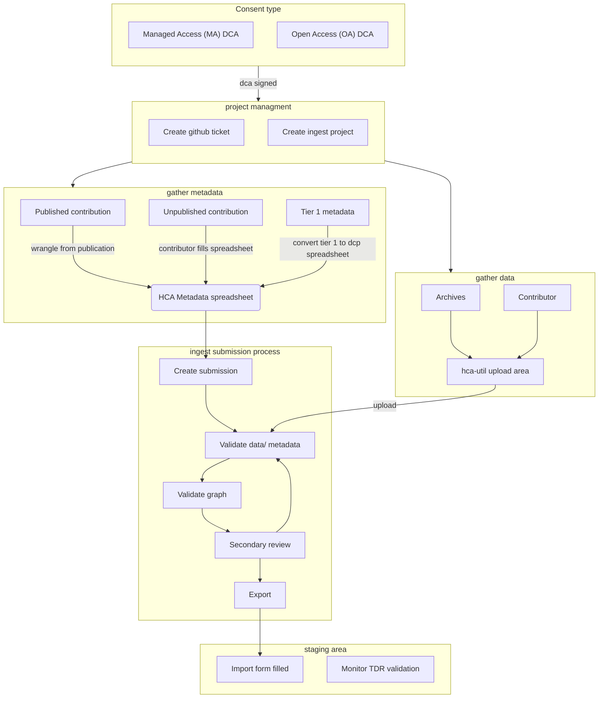

# Introduction

Welcome to the team! Here you can find some guidelines on how to get started in the wrangling process.  
Be sure to check the [onboarding document](/hca-ebi-wrangler-central/ebi-wrangler-onboarding) first.

As of 2025, the wrangling process starts from defining the consent type.

