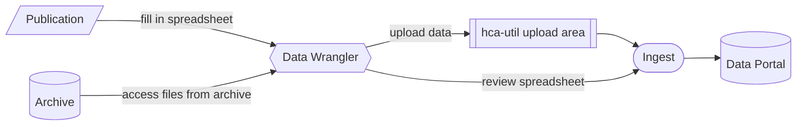
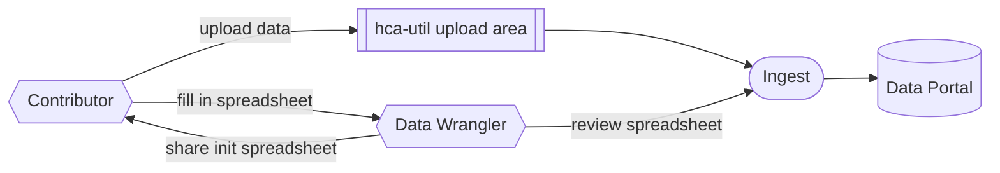
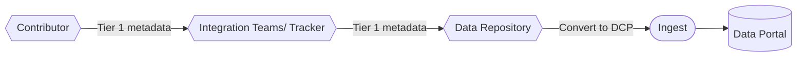
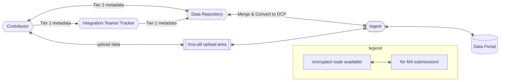

# Submission variations based on request types

As of 2025, we might have to deal with 4 types of submissions based the state of data/metadata:
1. Submission from Published project
1. Submission from Unpublished project
1. Tier 1 submission
1. Tier 2 submission

## Tier-ed metadata

Integration teams are using their own distinct metadata schema, to accomodate their needs. We can [convert](https://github.com/ebi-ait/hca-tier1-to-dcp) this Tier-ed schema into the [HCA metadata schema](https://github.com/HumanCellAtlas/metadata-schema/tree/master/json_schema), in order to proceed with ingestion into the DCP2.0. 

More information can be found in [here](https://ebi-ait.github.io/hca-ebi-wrangler-central/SOPs/Introduction/hca_metadata_struct.html), or the [confluence page](https://embl.atlassian.net/wiki/spaces/HCA/pages/142936546/HCA+metadata+schema+s+-+decisions).

In cases 1-2 we would need to gather the metadata (case 1), or help the contributor to gather the metadata (case 2).

On the other hand, Tier-ed metadata can be easily converted to HCA schema therefore there is limited curation required for the submission to be complete. 

## 1. Submission from published project

### Why?
We might have to wrangle a dataset from a publication. One case would be because contributor is not responding but project is valuable for the atlas. Other reason could be that project is HCA publication.

### How?

- No contact with contributor is achieved
- DCA might be required

## 2. Submission from unpublished project

### Why?
We might have to wrangle a dataset that has not been published before. One case could be that project is HCA publication but it has not been published yet.

### How?

- No contact with contributor is achieved
- DCA might be required

## 3. Tier 1 submission

### Why?
We only need to submit Tier 1 metadata, with the analysis file(s). This would be useful if we wanna add the source study into the Data Portal despite that we don't have Sequence data or Tier 2 metadata.

### How?

- Contributor has already provided Tier 1 metadata to the Integration Teams
- No need for Data Repository to communicate with contributor
- No DCA is needed for only-Tier 1 metadata submission
- Converting of tier-ed metadata can be done via [this](https://github.com/ebi-ait/hca-tier1-to-dcp)

## 4. Tier 2 submission

### Why?
We need to submit Tier 2 metadata.

### How?

- Contributor has already provided Tier 1 metadata to the Integration Teams
- Data Repository need to communicate with contributor for signing a DCA & accessing Tier 2 and/or sequence data
- MA or OA DCA has to be signed
- Merge and convert of tier-ed metadata can be done via [this](https://github.com/ebi-ait/hca-tier1-to-dcp)