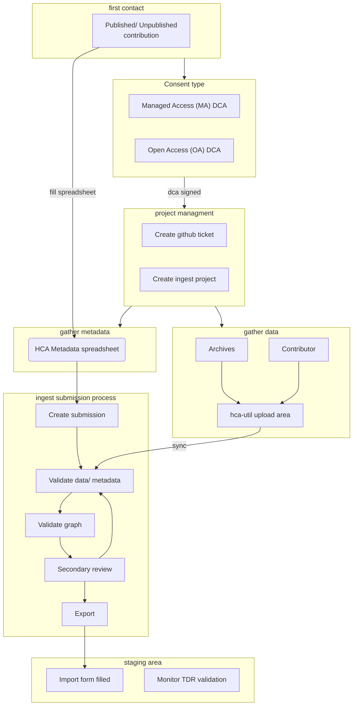

As of 2025, once a dataset has been selected to be wrangled, the wrangling process starts from defining the consent type.
> For a version with clickable document links, visit the GitHub site https://github.com/ebi-ait/hca-ebi-wrangler-central/blob/master/docs/SOPs/Introduction/wrangling_process_diagram.md
> 
> Github Pages does not allow `mermaid` clickable links

