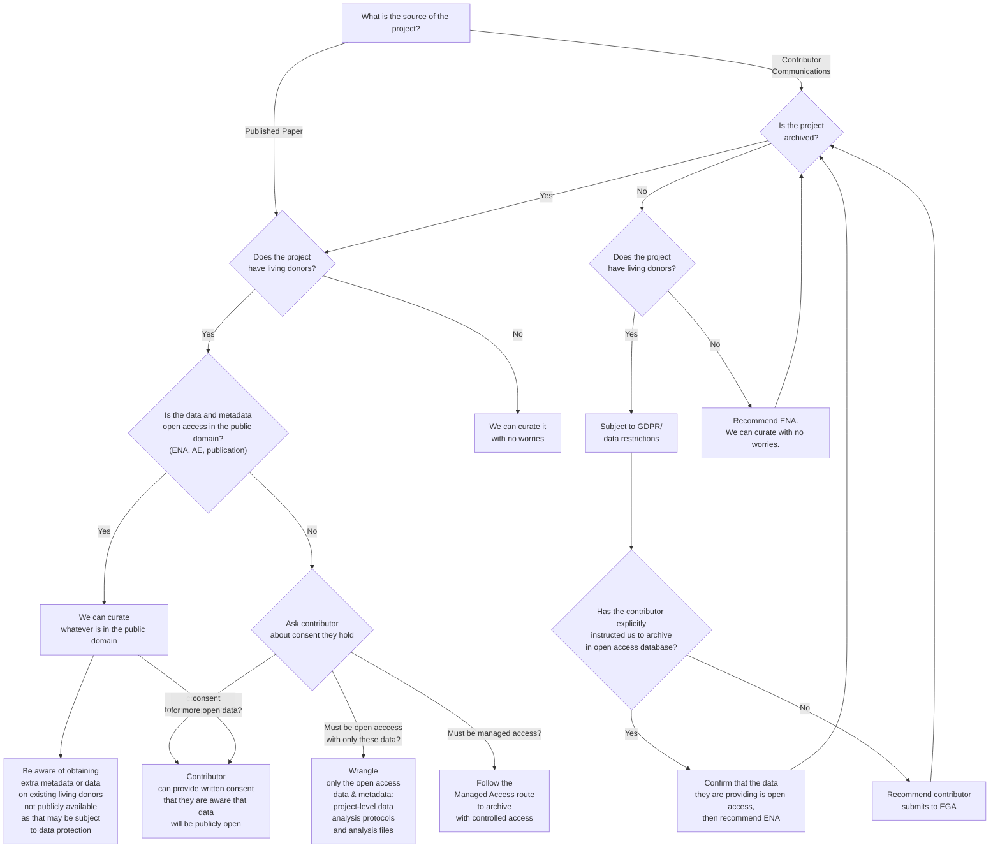

# GDPR_Guidelines
{: .no_toc }

## Table of contents
{: .no_toc .text-delta }

1. TOC
{:toc}

## Purpose of this document

This document will serve to display our guidelines for GDPR and data protection restrictions when wrangling. 

## Summary diagram

## Specific guidelines

GDPR concerns arise when dealing with living donors, as HCA sticks to a strict interpretation of the regulations. One of the first assessments a wrangler has to do when wrangling a dataset (contributor-led or publication-led) is to determine whether there are living donors or not, to comply with our GDPR restrictions. Those donors alive at the moment of sample collection are subjected to GDPR restrictions. Thus, deceased and pre-natal donors can be wrangled without taking these GDPR guidelines into consideration.

### Data 
When wrangling any kind of data or metadata related to living donors, wranglers can only ingest into the system data that is already in the public domain. Wranglers shoud **never ask for extra data**. Here by data we specifically refer to:

- Raw fastq files
- Raw gene expression matrices (TBD - discussion with Tony)
- Processed gene expression matrices (TBD - discussion with Tony)

When wrangling **contributor led** publications, wranglers cannot recommend or suggest the contributors to archive their data in an open database if living donors are involved. Wranglers are also not allowed to state to the contributors that they could take the data and metadata from an open database once it's published there, as it might lead the contributors to make their data publicly available. **HCA recommendation when dealing with living donors should always be managed access**

### Metadata
When wrangling from already **published projects**, wranglers should **never ask for extra donor metadata** if it involves living donors. Wranglers are allowed to take the information that the authors have made already of **public domain**. Wranlger may include previously unreleased metadata provided by the author only if the author gave  **written consent** for its public release as open access. ~~Moreover, to prevent low *k-anonymity* [^1] levels, wranglers should **avoid wrangling donor metadata when the project includes less than 5 living donors**. ~~

[^1]: A release of data is said to have the k-anonymity property if the information for each person contained in the release cannot be distinguished from at least k - 1 individuals whose information also appear in the release.
