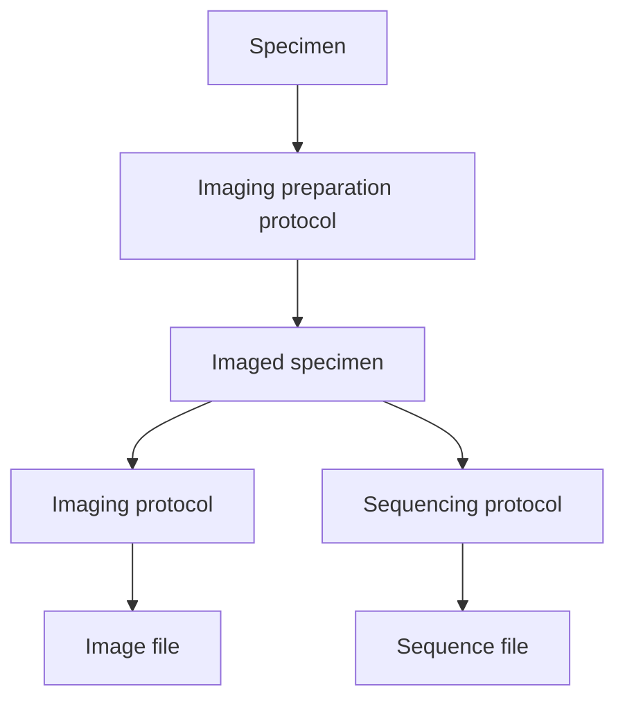

# How to curate 10X Visium Gene Expression Data

### Overview

This guide is intended to hightlight the ***required metadata*** for 10X Visium data. Optional metadata fields should be evaluated on an individual project basis given the experimental design and available metadata.

The ***required metadata*** includes:

1. [metadata fields labelled as required in the metadata schema (i.e. necessary for validation)](#required-metadata)

2. [ontology terms: library construction method, sequencing method](#ontology-terms)

3. [image file types that we require based on discussion with researchers (not evaluated during metadata schema validation)](#image-files)

4. [analysis file types that we require based on discussion with researchers (not evaluated during metadata schema validation)](#analysis-files)

### Required metadata

Required metadata are labelled in the template spreadsheet. Some metadata is required only if the tab is present in the spreadsheet
and not left empty. For 10X Visium data, the following tabs should be filled:

- Imaged specimen
- Imaging preparation protocol
- Imaging protocol

Example Graph:

### Ontology terms

- See [technology type table](https://github.com/ebi-ait/hca-ebi-wrangler-central/blob/master/docs/technology_type_table.md)

### Image file(s)

- Image file(s) associated with each imaged specimen should be included as a supplementary file in the Imaged specimen tab.

- At least 1 image file per imaged specimen should be overlaid with 10X Visium image coordinates. [See detected_tissue_image.jpg.](https://github.com/ebi-ait/hca-ebi-wrangler-central/blob/master/technology_types_guide/10X_Visium/example_dataset/detected_tissue_image.jpg)

### Analysis file(s)

- For each imaged specimen, there should be a list of 10X Visium spatial barcodes linked to the image coordinates. [See tissue_positions_list.csv.](https://github.com/ebi-ait/hca-ebi-wrangler-central/blob/master/technology_types_guide/10X_Visium/example_dataset/tissue_positions_list.csv)

- If the imaged specimen(s) have been annotated by a contributor (e.g. organ-specific anatomical parts), ideally, we should include a file linking the annotations to the image coordinates.
